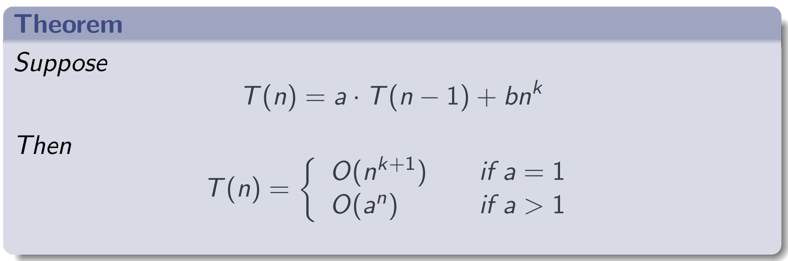

# Recursion

**Definition:** Breaking down a problem into smaller, similar subproblems until reaching a base case.

- **Base Case (B):** Defines initial conditions.
- **Recursive Process (R):** Describes how to generate subsequent terms from previous ones until reaching the base case.

# Solving recurrences

Approaches to solve recursion equations for calculating **time complexity**:

- **Unwinding the recurrence**
- **Approximating with big-O**
- **The Master Theorem**

