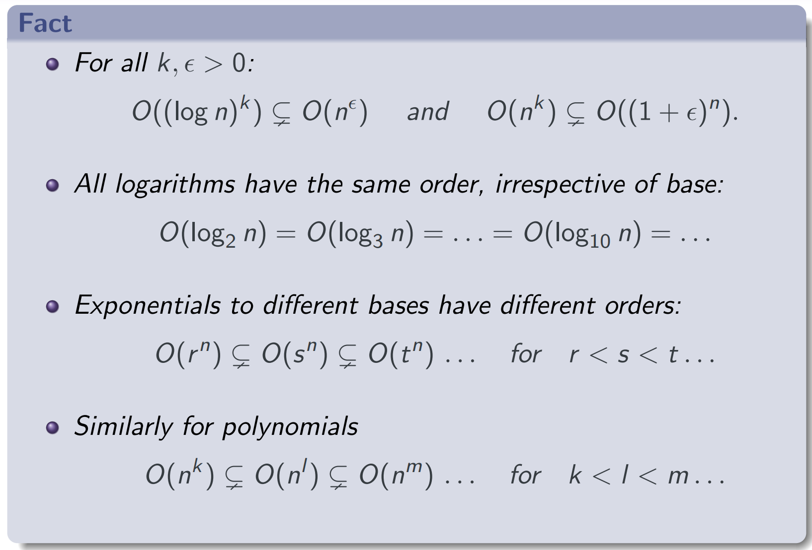

# Functional Composition

**Definition:** If \( f : S → T \) and \( g : T → U \) then the composition of \( f \) and \( g \), written \( g ◦ f \), is the function given by \( (g ◦ f )(x) = g(f (x)) \). That is, \( g ◦ f = f ; g \).

- **Associative:** \( h ◦ (g ◦ f ) = (h ◦ g) ◦ f \)
- **For \( g : S → T \):**
    - \( g ◦ Id_S = g \)
    - \( Id_T ◦ g = g \)

## Iteration of Functions

- \( f ◦ f = f^2 \)

## Inverse Functions

**Definition:** If \( f^← \) is a function then it is called the inverse function; denoted \( f^{-1} \)

- \( f^{-1} \) only exists if f is a bijection
- \( f^← \) always exists

### Properties of the inverse

- If \( f : S → T \) and \( f^{-1} \) exists then:
    
    \( f^{-1} ◦ f = Id_S \) and \( f ◦ f^{-1} = Id_T \)
    
- Conversely, if \( f : S → T \) and \( g : T → S \) and \( g ◦ f = Id_S \) and \( f ◦ g = Id_T \)
    
    then \( f^{-1} \) exists and is equal to \( g \)
    

# Matrices

## Transpose \( T \)

Transposes the **rows** and **columns** of a matrix

### Symmetric

\( M^T = M \)

## Matrix Sum

### Fact:

\( A + B = B + A \) and \( (A + B) + C = A + (B + C) \)

## Matrix Product

\( A \cdot B \neq B \cdot A \)

# Introduction to Big-O Notation

**Definition:** \( f \) is an upper bound of \( g \), if there exists \( n_0 ∈ N \) and a real constant \( c > 0 \) such that for all \( n ≥ n_0 \), \( g(n) ≤ c \cdot f (n) \), denoted \( O(f (n)) \)

### Criteria:

\( f (n) ∈ O(g(n)) \) if and only if \( \lim_{n→∞} \frac{f (n)}{g(n)} < ∞ \)

### Fact:

- \( f (n) + j(n) ∈ O(g(n) + k(n)) \), addition merging
- \( f (n) \cdot j(n) ∈ O(g(n) \cdot k(n)) \), multiplication merging

## Big-Omega \( Ω \)

**Definition:** \( f \) is a lower bound of \( g \), if there exists \( n_0 ∈ N \) and a real constant \( c > 0 \) such that for all \( n ≥ n_0 \), \( g(n) ≥ c \cdot f (n) \)

## Big-Theta \( Θ \)

**Definition:** Asymptotically equivalent, \( c \cdot f (n) ≤ g(n) ≤ d \cdot f (n) \)

